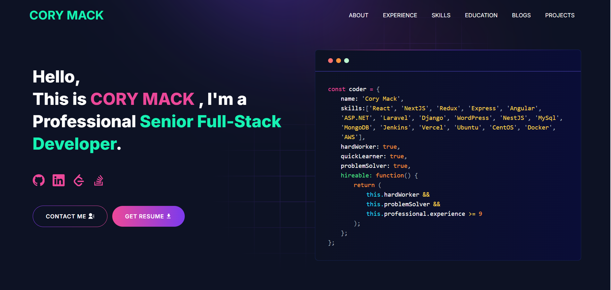

# 🚀 Cory's Developer Portfolio

Welcome to my personal portfolio website built with [Next.js](https://nextjs.org) and deployed on [Vercel](https://vercel.com). This site showcases my projects, skills, and experience as a full stack developer.


# Demo :movie_camera:



## View live preview [here](https://corymack.vercel.app/).

---

## ✨ Features

- **Responsive Design**: Fully responsive and optimized for mobile and desktop devices.
- **Projects Showcase**: Display of featured projects with descriptions, technologies used, and live demos.
- **Dynamic Blog**: Integrated blog section with posts about my journey, tutorials, and insights into web development.
- **Contact Form**: Easily get in touch with me through a dynamic contact form.
- **Fast and SEO-optimized**: Lightning-fast performance with search engine optimization.

---

## Table of Contents :scroll:

- [Sections](#sections-bookmark)
- [Demo](#demo-movie_camera)
- [Installation](#installation-arrow_down)
- [Getting Started](#getting-started-dart)
- [Usage](#usage-joystick)
- [Packages Used](#packages-used-package)

---

# Sections :bookmark:

- HERO SECTION
- ABOUT ME
- EXPERIENCE
- SKILLS
- PROJECTS
- EDUCATION
- BLOG
- CONTACTS

---

# Installation :arrow_down:

### You will need to download Git and Node to run this project

- [Git](https://git-scm.com/downloads)
- [Node](https://nodejs.org/en/download/)

#### Make sure you have the latest version of both Git and Node on your computer.

```
node --version
git --version
```

## <br />

# Getting Started :dart:

### Fork and Clone the repo

To Fork the repo click on the fork button at the top right of the page. Once the repo is forked open your terminal and perform the following commands

```
git clone https://github.com/<YOUR GITHUB USERNAME>/developer-portfolio.git

cd developer-portfolio
```

### Install packages from the root directory

```bash
npm install
# or
yarn install
```

Then, run the development server:

```bash
npm run dev
# or
yarn dev
```

Open [http://localhost:3000](http://localhost:3000) with your browser to see the result.

---

# Usage :joystick:

Goto [emailjs.com](https://www.emailjs.com/) and create a new account for the mail sending. In free trial you will get 200 mail per month. After setup `emailjs` account, Please create a new `.env` file from `.env.example` file.

Eg:

```env
NEXT_PUBLIC_EMAILJS_SERVICE_ID =
NEXT_PUBLIC_EMAILJS_TEMPLATE_ID =
NEXT_PUBLIC_EMAILJS_PUBLIC_KEY =
NEXT_PUBLIC_GTM = # For site analytics
NEXT_PUBLIC_APP_URL = "http://127.0.0.1:3000"
NEXT_PUBLIC_RECAPTCHA_SECRET_KEY = # For captcha verification on contact form
NEXT_PUBLIC_RECAPTCHA_SITE_KEY =
```

### Then, Customize data in the `utils/data` [folder](https://github.com/said7388/developer-portfolio/tree/main/utils/data).

Eg:

```javascript
export const personalData = {
  name: "Cory Mack",
  profile: "/profile.png",
  designation: "Full-Stack Software Developer",
  description: "My name is Handsome Guy....",
  email: "handsomeguy@gmail.com",
  phone: "+16923541564",
  address: "Hazelwood, MO 63042",
  github: "https://github.com/high5dev",
  linkedIn: "https://www.linkedin.com/in/cory-mack-480231294",
  stackOverflow: "https://stackoverflow.com/users/17946244/oneshot621",
  leetcode: "https://leetcode.com/u/high5dev/",
  devUsername: "high5dev",
  resume: "...",
};
```

`devUsername` Used for fetching blog from `dev.to`.

---

---

# Packages Used :package:

| Used Package List  |
| :----------------: |
|        next        |
|  @emailjs/browser  |
|    lottie-react    |
| react-fast-marquee |
|    react-icons     |
|   react-toastify   |
|        sass        |
|    tailwindcss     |

---
